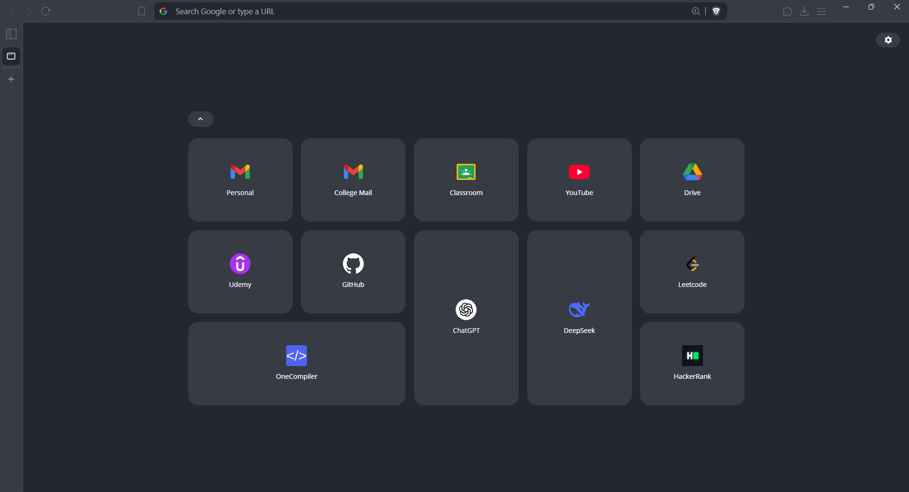
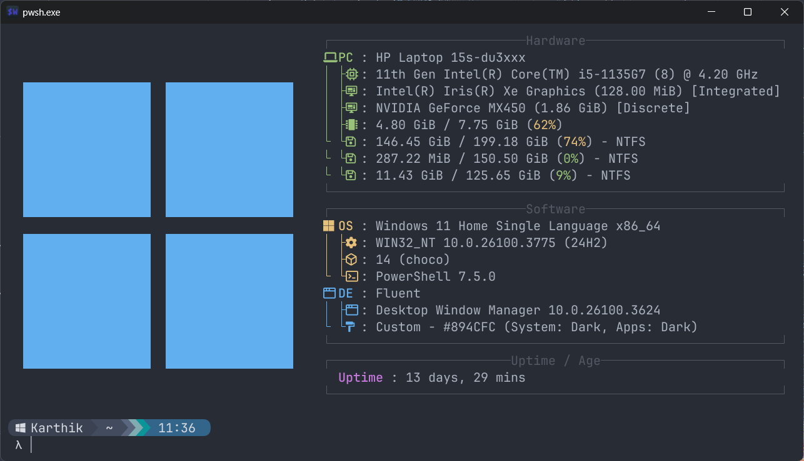

# Configurations

## Brave Browser

### 🔹 Brave

-   [Brave browser](https://brave.com)
-   [Brave Theme Link](https://github.com/KarthikSapaliga/config/tree/main/brave)

### 🔹 nightTab

-   [nightTab GitHub](https://github.com/zombieFox/nightTab)
-   [nightTab Config](https://github.com/KarthikSapaliga/config/tree/main/nighttab)

## Terminal

### 🔹 Windows Terminal

-   [Windows Terminal Github](https://github.com/microsoft/terminal)
-   [Windows Terminal Configuration](https://github.com/KarthikSapaliga/config/tree/main/powershell)

### 🔹 Fastfetch

-   [Fastfetch GitHub](https://github.com/fastfetch-cli/fastfetch)
-   [Fastfetch Config](https://github.com/KarthikSapaliga/config/tree/main/fastfetch)

### 🔹 Starship Prompt

-   [Starship Official Site](https://starship.rs)
-   [Starship Config](https://github.com/KarthikSapaliga/config/tree/main/starship)
